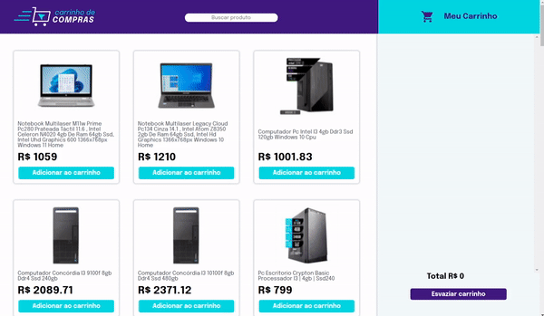

# Shopping Cart

Essa é uma implementação de carrinho de compras dinâmico, que possibilita o usuário a buscar diferentes produtos, adicionar e remover itens do carrinho, sendo ele salvo automaticamente a cada alteração.
Tudo isso com testes pensados para os casos de uso da aplicação, garantindo a qualidade e integridade do código.
A aplicação consome a API pública do Mercado Livre.

O foco dessa projeto foi explorar o consumo de APIs e a metodologia TDD (test driven development).

[Experimente!](https://lzaghi.github.io/to-do-list/)

## Funcionalidades

- Busca de diferentes produtos
- Inserção e remoção de itens no carrinho
- Valor total atualizado a cada ação
- Carrinho salvo automaticamente a cada ação
- Salvar a lista

## Demonstração




## Tecnologias utilizadas

HTML, CSS, JavaScript, DOM, Jest


## Instalação local

1. Clone o repositório 
```bash
  git clone git@github.com:lzaghi/shopping-cart.git
```

2. Entre no diretório 
```bash
  cd shopping-cart
```

3. Instale as dependências 
```bash
  npm install
```
4. Inicie a aplicação com a extensão Live Server do VSCode


